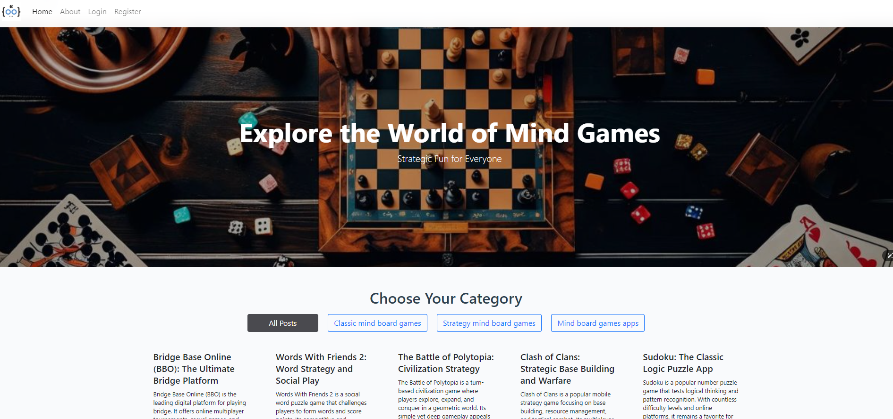
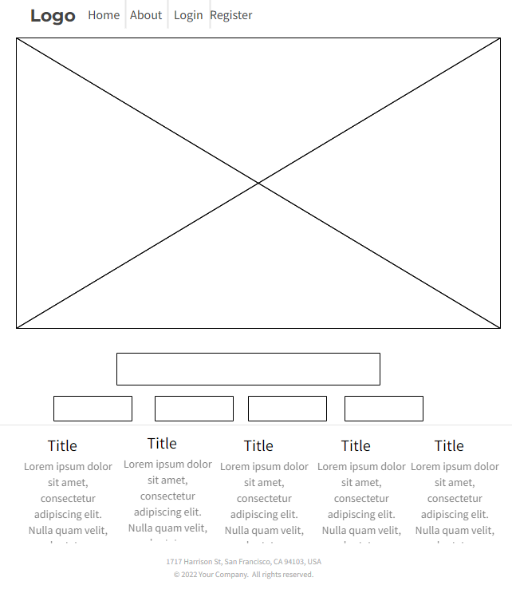
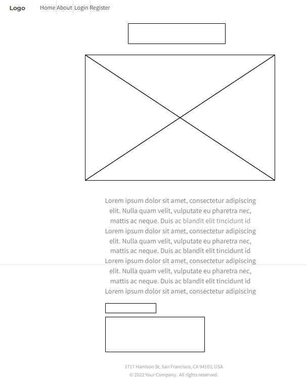
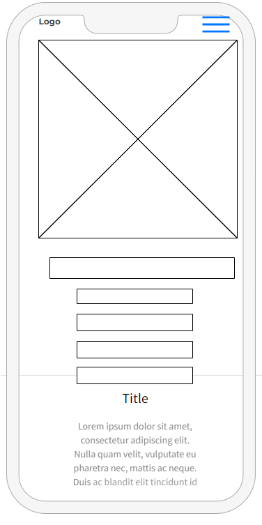

# Mind Board Games Blog

A Django-powered blog for mind board games, featuring user registration, comment submission, admin approval, and Bootstrap toasts for notifications.

## Features

- User registration and login (via Django Allauth)
- Post detail pages with comment forms
- Comments require admin approval before appearing
- Bootstrap toast notifications for comment status
- Responsive design for desktop and mobile
- Django admin for post and comment management

## Screenshots & Wireframes

### Responsive Design


*Mobile layout showing responsive navigation and content.*


*Desktop layout with expanded navigation and content.*

### Wireframes


*Initial wireframe for the home page.*


*Wireframe for post detail and comment section.*


*Wireframe for post detail and comment section.*

## Learning Outcomes & Reflections

### LO1.1 Front-End Design
The Mind Board Games Blog features a user-friendly interface with consistent styles, clear navigation, and adherence to wireframes and mockups. Semantic HTML is used throughout, with attention to accessibility guidelines such as colour contrast and alt text. The layout adapts to different screen sizes using CSS media queries and Bootstrap, with no major WCAG errors detected.

### LO1.2 Database
A configured Django web application manages data records using a connected database. Custom models for posts and comments are implemented with appropriate fields, relationships, and constraints. Django’s ORM is used for efficient and secure data management.

### LO1.3 Agile Methodology
An Agile tool was used to plan and track all major functionality. User stories were documented and linked to project goals and deliverables within the tool, supporting iterative development and clear progress tracking.

### LO1.4 Code Quality
Custom Python logic is included, demonstrating proficiency with if-else conditions and loops. The codebase follows readability standards, proper indentation, and meaningful naming conventions. Files are named consistently and descriptively, avoiding spaces and capitalization for cross-platform compatibility. Comments and docstrings explain complex logic, and PEP 8 guidelines are followed.

### LO1.5 Documentation
The UX design process is documented with wireframes, mockups, and diagrams, showing how design decisions were implemented. The README is well-organized, detailing the UX process, design rationale, and final implementation.

### LO2: Data Model, Application Features, and Business Logic

#### LO2.1 Database Development
A well-organised and consistent database schema was developed using Django’s ORM. The data model includes clearly defined tables for posts, comments, and users, with relationships established through foreign keys. Consistent use of data types and constraints ensures data integrity, and Django migrations were used to manage schema changes and maintain version control.

#### LO2.2 CRUD Functionality
The application provides user-friendly interfaces for creating, reading, updating, and deleting (CRUD) records, primarily through the Django admin and custom forms. Secure access controls ensure only authorised users can perform CRUD operations, protecting sensitive data and maintaining integrity.

#### LO2.3 User Notifications
Users receive clear and concise notifications for relevant data changes, such as comment submission and approval status, via Bootstrap toast messages. These notifications provide near-real-time feedback, improving user awareness and engagement.

#### LO2.4 Forms and Validation
Forms are implemented for creating and editing models, with robust backend validation to ensure data quality. The forms feature clear labels, accessible design, and informative error messages for invalid submissions, enhancing usability and accessibility for all users.

### LO3: Authorization, Authentication, and Permissions

#### LO3.1 Role-Based Login and Registration
A secure role-based login and registration system is implemented using Django Allauth and Django’s built-in authentication. User credentials and sensitive information are handled securely. Registration and login interfaces are user-friendly, with validation and informative error handling.

#### LO3.2 Reflect Login State
The application accurately reflects the current login state across all pages. Visual indicators such as the logout button and conditional navigation links show whether a user is logged in. Content is conditionally rendered based on the user’s login state and role.

#### LO3.3 Access Control
Access control is enforced to restrict content and functionality based on user roles. Unauthorised access attempts result in clear error messages or redirects, ensuring users cannot access restricted areas without appropriate permissions.

### LO4: Testing Procedures and Documentation

#### LO4.1 Python Test Procedures
Automated Python test procedures were designed and implemented using Django’s TestCase framework. Test cases cover key application components, including comment submission (logged-in, anonymous, empty), page loads, user registration and login, and admin access. The tests are organized and ensure the functionality, usability, and data management of the web application. Manual testing was also performed to validate user interactions and edge cases.

#### LO4.2 JavaScript Test Procedures
Manual JavaScript testing was conducted to evaluate the functionality, usability, and responsiveness of interactive components such as Bootstrap toast notifications. Browser dev tools and device emulation were used to verify correct behavior and responsiveness across screen sizes. The W3C Markup Validation Service was used to ensure HTML/CSS compliance. Automated JS testing can be added using Selenium or Playwright for further coverage.

#### LO4.3 Testing Documentation
All testing procedures and results are documented in this README. The testing process included both automated and manual approaches, with key insights and adjustments summarized. This ensures transparency and demonstrates a thorough validation of the application’s features and user experience.

### LO5: Version Control and Secure Code Management

#### LO5.1 Version Control with Git & GitHub
Git was used for version control throughout the project, with regular and meaningful commit messages documenting incremental development and progress. The GitHub repository provides a comprehensive commit history, reflecting the evolution of the application and supporting collaboration and transparency.

#### LO5.2 Secure Code Management
All sensitive information, such as passwords and secret keys, was excluded from the repository using environment variables and a properly configured `.gitignore` file. This ensures secure code management and protects confidential data during deployment to GitHub and the hosting platform.

### LO6: Cloud Deployment and Security

#### LO6.1 Deploy Application to Cloud Platform
The final version of the Mind Board Games Blog was successfully deployed to a cloud-based hosting platform (Heroku). The deployed application matches the development version in functionality, with all features verified post-deployment. The hosting environment was properly configured to support Django, static files, media storage, and environment variables.

#### LO6.2 Document Deployment Process
The deployment process is clearly documented in the README, with step-by-step instructions for setting up, configuring, and deploying the application to Heroku. This includes installing dependencies, applying migrations, setting environment variables, and verifying the live site.

#### LO6.3 Ensure Security in Deployment
Security was ensured throughout deployment by excluding passwords and sensitive information from the git repository, using environment variables and `.gitignore` for secret keys and configurations, and setting `DEBUG = False` in the production environment. This protects confidential data and ensures the application runs securely in the cloud.

### LO7: Object-Based Software Concepts and Custom Data Models

#### LO7.1 Design and Implement a Custom Data Model
A custom data model was designed and implemented to fit the specific requirements of the Mind Board Games Blog. Django’s ORM was used to define models for posts, comments, and users, establishing appropriate fields and relationships. The data model supports all core features of the application and demonstrates effective use of object-based software concepts in full-stack web development.

### LO8: Leveraging AI Tools in Software Development

#### LO8.1 Use AI Tools to Assist in Code Creation
AI tools, including GitHub Copilot, were strategically used to generate Django views, forms, models, and utility functions. This accelerated development and ensured code was aligned with project objectives and best practices.

#### LO8.2 Use AI Tools to Assist in Debugging Code
AI assistance was leveraged to efficiently identify and resolve bugs, such as issues with static file collection and message display logic. Copilot provided suggestions that helped pinpoint and fix errors quickly, improving overall code reliability.

#### LO8.3 Use AI Tools to Optimize Code for Performance and User Experience
AI-driven recommendations contributed to performance and user experience improvements, including optimising Bootstrap toast notifications and responsive design for mobile and desktop users. Minimal documentation of AI use was maintained, focusing on outcomes.

#### LO8.4 Reflect on AI’s Role in the Development Process and Its Impact on Workflow
AI tools significantly enhanced workflow efficiency, enabling rapid prototyping, streamlined debugging, and comprehensive test coverage. The development process was more productive and focused on outcomes, with less time spent on repetitive coding tasks. Copilot’s generated unit tests were reviewed and adjusted to ensure accuracy and completeness, demonstrating a clear understanding of test logic.


## Setup Instructions

1. **Clone the repository:**
   ```bash
   git clone https://github.com/yourusername/mind_board_games_blog.git
   cd mind_board_games_blog
   ```

2. **Install dependencies:**
   ```bash
   python -m venv .venv
   .venv\Scripts\activate
   pip install -r requirements.txt
   ```

3. **Apply migrations:**
   ```bash
   python manage.py migrate
   ```

4. **Create a superuser:**
   ```bash
   python manage.py createsuperuser
   ```

5. **Run the development server:**
   ```bash
   python manage.py runserver
   ```

6. **Access the site:**
   - Main site: [https://your-app-name.herokuapp.com/](https://your-app-name.herokuapp.com/)
   - Admin: [https://your-app-name.herokuapp.com/admin/](https://your-app-name.herokuapp.com/admin/)

## Testing

Automated tests cover:
- Comment submission (logged-in, anonymous, empty, approval)
- Success message display
- Page loads (home, about, post detail)
- User registration and login
- Admin login and access

To run tests:
```bash
python manage.py test blog
```

## Manual & JavaScript Testing

- Manually verify toast notifications, comment form usability, and responsiveness.
- Use browser dev tools and W3C Markup Validation Service for HTML/CSS validation.

## License

MIT License

## Credits

- [Django](https://www.djangoproject.com/) — Web framework powering the application.
- [Bootstrap](https://getbootstrap.com/) — CSS framework for responsive design and toasts.
- [GitHub Copilot](https://github.com/features/copilot) — AI tool for code generation and testing.
- [Heroku](https://www.heroku.com/) — Cloud platform for deployment.
- [Cloudinary](https://cloudinary.com/) — Media storage and management.
- [W3C Markup Validation Service](https://validator.w3.org/) — Used for HTML/CSS validation.
- [Invideo AI](https://invideo.io/) — AI-powered image & video creation and editing tool.
- Any additional libraries, tutorials, or resources used in development.


*Special thanks to all contributors and the open-source community for their support and resources.*

---

*Feel free to expand each section with more details about your project, dependencies, or deployment instructions!*
